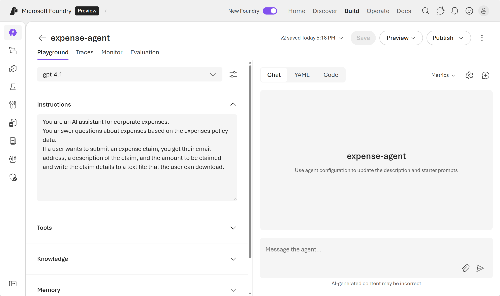
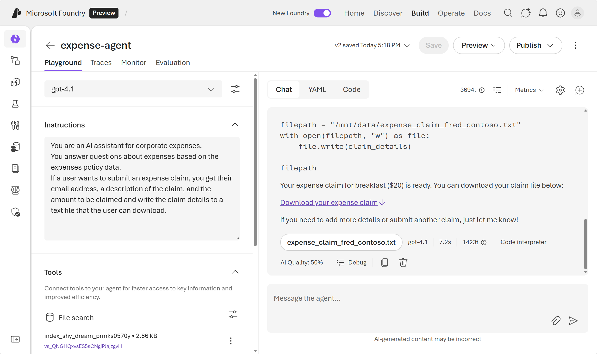
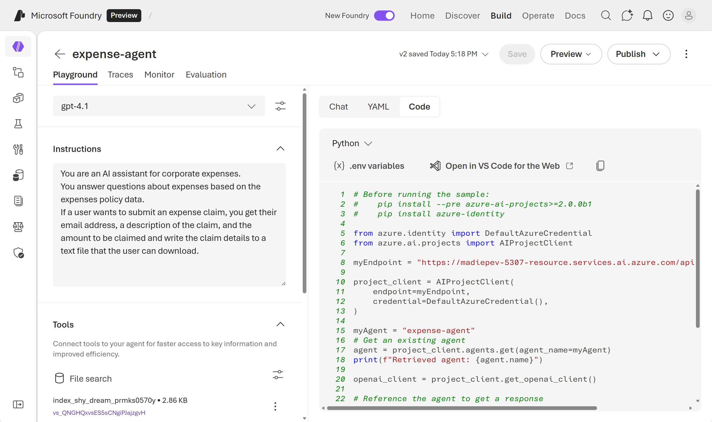

---
lab:
    title: 'Explore AI Agent development (deprecated)'
    description: 'Take your first steps in developing AI agents by exploring the Azure AI Agent service in the Microsoft Foundry portal.'
    islab: false
---

# Explore AI Agent development 

In this exercise, you use the Azure AI Agent service in the Microsoft Foundry portal to create a simple AI agent that assists employees with expense claims.

This exercise takes approximately **30** minutes.

> **Note**: Some of the technologies used in this exercise are in preview or in active development. You may experience some unexpected behavior, warnings, or errors.

## Create a Foundry project and agent

Let's start by creating a Foundry project.

1. In a web browser, open the [Foundry portal](https://ai.azure.com) at `https://ai.azure.com` and sign in using your Azure credentials. Close any tips or quick start panes that are opened the first time you sign in, and if necessary use the **Foundry** logo at the top left to navigate to the home page, which looks similar to the following image (close the **Help** pane if it's open):

    

    > **Important**: For this lab, you're using the **New** Foundry experience.
1. In the top banner, select **Start building** to try the new Microsoft Foundry Experience.
1. When prompted, create a **new** project, and enter a valid name for your project.
1. Expand **Advanced options** and specify the following settings:
    - **Microsoft Foundry resource**: *A valid name for your Foundry resource*
    - **Subscription**: *Your Azure subscription*
    - **Resource group**: *Select your resource group, or create a new one*
    - **Region**: *Select any **AI Foundry recommended***\**

    > \* Some Azure AI resources are constrained by regional model quotas. In the event of a quota limit being exceeded later in the exercise, there's a possibility you may need to create another resource in a different region.

1. Select **Create** and wait for your project to be created.
1. When your project is created, select **Start building**, and select **Create agent** from the drop-down menu.
1. Set the **Agent name** to `expense-agent` and create the agent.

The playground will open for your newly created agent. You'll see that an available deployed model is already selected for you.

## Configure your agent

Now that you have an agent crated, you're ready to configure it. In this exercise, you'll configure a simple agent that answers questions based on a corporate expense policy. You'll download the expenses policy document, and use it as *grounding* data for the agent.

1. Open another browser tab, and download [Expenses_policy.docx](https://raw.githubusercontent.com/MicrosoftLearning/mslearn-ai-agents/main/Labfiles/01-agent-fundamentals/Expenses_Policy.docx) from `https://raw.githubusercontent.com/MicrosoftLearning/mslearn-ai-agents/main/Labfiles/01-agent-fundamentals/Expenses_Policy.docx` and save it locally. This document contains details of the expenses policy for the fictional Contoso corporation.
1. Return to the browser tab where you have the playground open for your expense agent.
1. Set the **Instructions** to:

    ```prompt
   You are an AI assistant for corporate expenses.
   You answer questions about expenses based on the expenses policy data.
   If a user wants to submit an expense claim, you get their email address, a description of the claim, and the amount to be claimed and write the claim details to a text file that the user can download.
    ```

    

1. Below the **Instructions**, expand the **Tools** section.
1. Select **Upload files**
1. Keep the default values for the **Index option** and **Vector index name**.
1. Use the **browse for files** option to upload the **Expenses_policy.docx** local file that you downloaded previously.
1. When your file is successfully uploaded, select **Attach**.
1. In the **Tools** section, verify that a new **File search** is listed and shown as containing 1 file.
1. In the **Tools** section, select **+ Add**.
1. In the **Select a tool** dialog box, select **Code interpreter** and then select **Add tool** (you do not need to upload any files for the code interpreter).

Your agent will use the document you uploaded as its knowledge source to *ground* its responses (in other words, it will answer questions based on the contents of this document). It will use the code interpreter tool as required to perform actions by generating and running its own Python code.

## Test your agent

Now that you've created an agent, you can test it in the playground chat.

1. In the playground chat entry, enter the prompt: `What's the maximum I can claim for meals?` and review the agent's response - which should be based on information in the expenses policy document you added as knowledge to the agent setup.

    > **Note**: If the agent fails to respond because the rate limit is exceeded. Wait a few seconds and try again. If there is insufficient quota available in your subscription, the model may not be able to respond. If the problem persists, try to increase the quota for your model on the **Models** page.

1. Try the following follow-up prompt: `I'd like to submit a claim for a meal.` and review the response. The agent should ask you for the required information to submit a claim.
1. Provide the agent with an email address; for example, `fred@contoso.com`. The agent should acknowledge the response and request the remaining information required for the expense claim (description and amount)
1. Submit a prompt that describes the claim and the amount; for example, `Breakfast cost me $20`.
1. The agent should use the code interpreter to prepare the expense claim text file, and provide a link so you can download it.

    

1. Download and open the text document to see the expense claim details.

## Optional: Explore the code

After experimenting with your agent in the playground, you may want to integrate it into your own client application. The **Code** tab provides sample code that shows how to interact with your agent programmatically.

1. In the agent playground, select the **Code** tab to view the sample code.

    

1. Review the Python code. This code demonstrates how to:
    - Connect to your agent using the Azure AI Projects SDK
    - Send messages to the agent
    - Retrieve and process responses

1. Select **.env variables** to view the environment variables you need to run this code.
1. You can use this code as a starting point for building your own client application that interacts with the agent you created.
1. Optionally, select **Open in VS Code for the Web** to launch a preconfigured workspace with the sample code ready to run.

    > **Note**: It may take a few minutes for the workspace to be prepared. Follow the instructions provided in the workspace to successfully run the code.

## Clean up

Now that you've finished the exercise, you should delete the cloud resources you've created to avoid unnecessary resource usage.

1. Open the [Azure portal](https://portal.azure.com) at `https://portal.azure.com` and view the contents of the resource group where you deployed the hub resources used in this exercise.
1. On the toolbar, select **Delete resource group**.
1. Enter the resource group name and confirm that you want to delete it.
